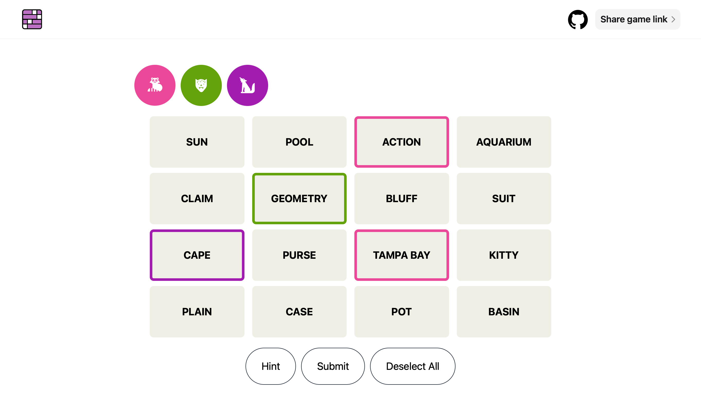

# Connections · Multiplayer

A multiplayer version of the NYT Connections game, built with Phoenix LiveView.

## Starting the server

  * Run `mix setup` to install and setup dependencies
  * Run `mix phx.gen.cert` to generate self-signed certificates for HTTPS in development, or remove the https configuration in `dev.exs`
  * Start Phoenix endpoint with `mix phx.server` or inside IEx with `iex -S mix phx.server`

Now you can visit [`localhost:4000`](http://localhost:4000) or [`https://localhost:4001`](https://localhost:4001) from your browser.