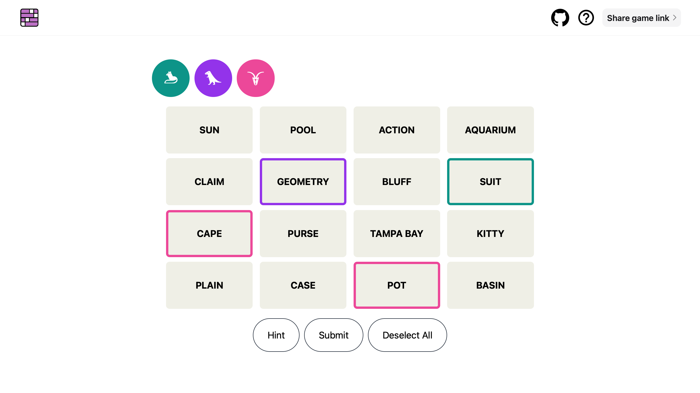

# Connections · Multiplayer

A multiplayer version of the [NYT Connections](https://www.nytimes.com/games/connections) game, built with Phoenix LiveView.

## Controls

- Find groups of four cards connected by a common theme, then tap **Submit** to see if you've found a connection.
- **Tap** to select/deselect cards.
- **Long press** to deselect a card selected by somebody else (avoids accidental "double taps" when playing with multiple players).
- **Hint** will give a two-card hint on the first tap and then a three card hint on subsequent taps.

## Differences from NYT's game

- Mutiplayer: I often play Connections with family, and I disliked having to all huddle around a single screen, with only one person in control.
- Infinite guesses: I always disliked that the NYT game reveals all the categories after four failed guesses, as I found hard puzzles the most fun to play.
- No shuffle: I never found shuffling useful for this sort of puzzle, so I didn't bother to implement it.
- Hints: On really hard days were I was having no luck, I often wanted a bit of a hint to get me going, rather than literally just brute forcing until I got an "almost there" prompt.

## Starting the server

  * Run `mix setup` to install and setup dependencies
  * Run `mix phx.gen.cert` to generate self-signed certificates for HTTPS in development, or remove the https configuration in `dev.exs`
  * Start Phoenix endpoint with `mix phx.server` or inside IEx with `iex -S mix phx.server`

Now you can visit [`localhost:4000`](http://localhost:4000) or [`https://localhost:4001`](https://localhost:4001) from your browser.